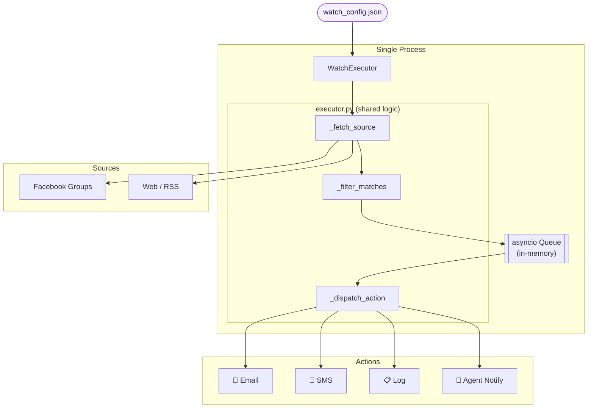
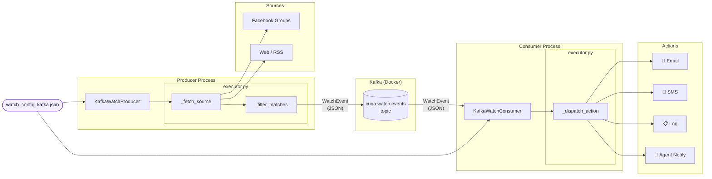

# cuga watch — Architecture

Two modes, one config schema. The **classic mode** runs everything in a single
process. The **Kafka mode** splits the pipeline into a producer process and a
consumer process connected by a Kafka topic.

---

## Classic Mode (single process)



---

## Kafka Mode (separate processes)



---

## What's shared between both modes

| Component | File | Used by |
|---|---|---|
| `_fetch_source` | `executor.py` | Classic WatchExecutor + Kafka Producer |
| `_filter_matches` | `executor.py` | Classic WatchExecutor + Kafka Producer |
| `_dispatch_action` | `executor.py` | Classic WatchExecutor + Kafka Consumer |
| `WatchConfig` models | `models.py` | All three |
| `KafkaConfig` / `KafkaWatchConfig` | `kafka_models.py` | Kafka only (extends WatchConfig) |

---

## Running locally

```bash
# 1. Start Kafka broker + UI (http://localhost:8080)
docker compose -f docker/kafka/docker-compose.yml up -d

# 2. Producer — polls sources, publishes matches to topic
python -m cuga.watch.kafka_producer docs/examples/kafka/watch_config_kafka.json

# 3. Consumer — reads topic, fires actions  (separate terminal)
python -m cuga.watch.kafka_consumer docs/examples/kafka/watch_config_kafka.json
```

The producer and consumer both read the **same config file**. The `kafka` block
is the only addition over the standard `watch_config.json` schema.
